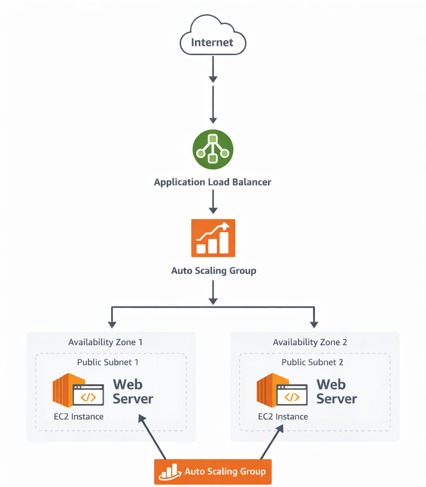

# 🚀 AWS Load Balancer with Auto Scaling Project

## 📌 Project Overview

This project demonstrates how to build a highly available and scalable web application using AWS Application Load Balancer and Auto Scaling Group.

The Load Balancer distributes incoming traffic across multiple EC2 instances, and Auto Scaling automatically adjusts the number of instances based on CPU utilization.

---

## 🏗️ Architecture Diagram



---

## ⚙️ Services Used

- EC2 (Elastic Compute Cloud)
- Application Load Balancer
- Auto Scaling Group
- Target Group
- VPC (Virtual Private Cloud)
- Public Subnets
- Security Groups

---

## 🌐 Architecture Flow

Internet  
↓  
Load Balancer  
↓  
Target Group  
↓  
Auto Scaling Group  
↓  
EC2 Instances (Subnet-1 & Subnet-2)

---

## 🛠️ Implementation Steps

### Step 1: Create VPC

- CIDR: 10.0.0.0/16

---

### Step 2: Create Public Subnets

- Subnet-1 → 10.0.1.0/24
- Subnet-2 → 10.0.2.0/24

---

### Step 3: Create Security Group

Allow:

- SSH (22)
- HTTP (80)

---

### Step 4: Create Launch Template

Configured:

- Ubuntu AMI
- t2.micro
- Apache installed using User Data

User Data Script:

```bash
#!/bin/bash
apt update -y
apt install apache2 -y
systemctl start apache2
echo "Hello from $(hostname)" > /var/www/html/index.html
```

---

### Step 5: Create Target Group

- Protocol: HTTP
- Port: 80

---

### Step 6: Create Application Load Balancer

Attach:
 - Subnet-1
 - Subnet-2
 - Attach Target Group

---

### Step 7: Create Auto Scaling Group

Configuration:
 - Min: 1
 - Desired: 1
 - Max: 3
Scaling Policy:
 - CPU Utilization: 50%

---

### 📊 Auto Scaling Test

Used stress tool:

```bash
stress-ng --cpu 1 --cpu-load 100 --timeout 300
```
New instance launched automatically.

---

🎯 Project Outcome

 - Built highly available architecture
 - Implemented automatic scaling
 - Improved fault tolerance
 - Learned real-time AWS production setup
